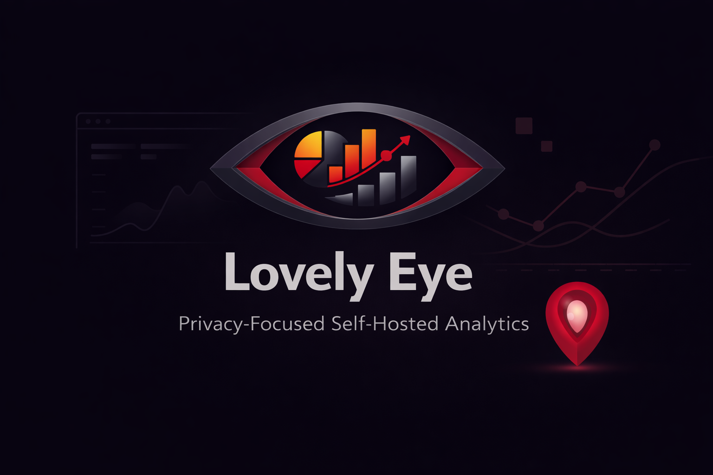

# Lovely Eye

Privacy-focused web analytics. Self-hosted alternative to Google Analytics, Umami and Plausible. Designed for low resource systems. Written in Go.



> [!WARNING]
> Work in progress

## Features

- **Privacy-first**: no cookies, daily visitor ID rotation
- **Bot filtering**: excludes crawlers, scrapers, monitoring bots
- **Lightweight**: low-RAM Docker builds, SQLite or PostgreSQL
- **Real-time dashboard**: GraphQL API with React UI
- **Custom events**: track clicks and user interactions

## Quick Start

### Docker (SQLite)

```yaml
services:
  lovely-eye:
    image: ghcr.io/revotale/lovely-eye:latest
    ports:
      - "8080:8080"
    environment:
      - JWT_SECRET=your-secret-key-min-32-chars
      # Optional: enable country stats with a MaxMind license key (auto-downloads to /data)
      - GEOIP_MAXMIND_LICENSE_KEY=your-maxmind-license-key
    volumes:
      - lovely-eye-data:/app/data
      # Optional: mount /data once for both SQLite and GeoIP
      - ./data:/data
    restart: unless-stopped

volumes:
  lovely-eye-data:
```

### Docker (PostgreSQL)

```yaml
services:
  lovely-eye:
    image: ghcr.io/revotale/lovely-eye:latest
    ports:
      - "${PORT:-8080}:8080"
    environment:
      - DB_DRIVER=postgres
      - DB_DSN=postgres://${POSTGRES_USER:-lovely}:${POSTGRES_PASSWORD:-lovely}@lovely-eye-db:5432/${POSTGRES_DB:-lovely_eye}?sslmode=disable
      - JWT_SECRET=${JWT_SECRET:?JWT_SECRET is required}
      - INITIAL_ADMIN_PASSWORD=${INITIAL_ADMIN_PASSWORD}
      - INITIAL_ADMIN_USERNAME=${INITIAL_ADMIN_USERNAME}
    depends_on:
      lovely-eye-db:
        condition: service_healthy
    networks:
      - lovely-eye-net
    restart: unless-stopped

  lovely-eye-db:
    image: postgres:18.1-alpine
    environment:
      - POSTGRES_USER=${POSTGRES_USER:-lovely}
      - POSTGRES_PASSWORD=${POSTGRES_PASSWORD:-lovely}
      - POSTGRES_DB=${POSTGRES_DB:-lovely_eye}
    volumes:
      - lovely-eye-data:/var/lib/postgresql
    networks:
      - lovely-eye-net
    healthcheck:
      test: ["CMD-SHELL", "pg_isready -U ${POSTGRES_USER:-lovely} -d ${POSTGRES_DB:-lovely_eye}"]
      interval: 5s
      timeout: 5s
      retries: 5
    restart: unless-stopped

volumes:
  lovely-eye-data:

networks:
  lovely-eye-net:

```

### From Source

Requires Go 1.25+.

```bash
cd server
go run ./cmd/server
```

Server starts at http://localhost:8080. The first registered user becomes admin. SQLite by default.

## Configuration

| Variable | Default | Description |
|----------|---------|-------------|
| `SERVER_HOST` | `0.0.0.0` | Server bind address |
| `SERVER_PORT` | `8080` | Server port |
| `DB_DRIVER` | `sqlite` | `sqlite` or `postgres` |
| `DB_DSN` | `file:data/lovely_eye.db?cache=shared&mode=rwc` | Database connection string |
| `JWT_SECRET` | (random) | JWT signing key (min 32 chars, required for production) |
| `SECURE_COOKIES` | `true` | Use secure cookies (requires HTTPS). Set to `false` for local dev |
| `ALLOW_REGISTRATION` | `false` | Allow new user registration after first user |
| `GEOIP_DB_PATH` | `/data/GeoLite2-Country.mmdb` | Path to GeoLite2-Country.mmdb for country stats |
| `GEOIP_DOWNLOAD_URL` | `https://download.db-ip.com/free/dbip-country-lite-YYYY-MM.mmdb.gz` | Custom GeoIP download URL (mmdb, gz, or tar.gz). DB-IP URLs will try the current and previous 2 monthly filenames automatically. |
| `GEOIP_MAXMIND_LICENSE_KEY` | - | MaxMind license key for GeoLite2 auto-download |

Country tracking downloads the GeoLite2 database on demand when at least one site enables it. If the download fails, the dashboard will show the error in site settings.

## Authentication

JWT tokens in HttpOnly cookies with SameSite settings:

- **HttpOnly**: Prevents JavaScript access (XSS protection)
- **Secure**: HTTPS only in production
- **SameSite=Strict** (production) or **Lax** (development): Prevents CSRF

No CSRF tokens needed. See [discussion](https://www.reddit.com/r/node/comments/1im7yj0/comment/mc0ylfd/).

## Tracking
See [ANALYTICS.md](./ANALYTICS.md) for tracking mechanics.

## Privacy
See [PRIVACY.md](./PRIVACY.md) for privacy handling.

### Track Custom Events

```html
<script>
  // Example: track an error event with metadata
  window.lovelyEye?.track('error', {
    message: 'Checkout failed',
    code: 'PAYMENT_DECLINED',
  });
</script>
```

Events must be allowlisted in the site settings. Unknown event names or fields are ignored.

## License

Copyright 2025 RevoTale

Licensed under [AGPL-3.0](./LICENSE).
